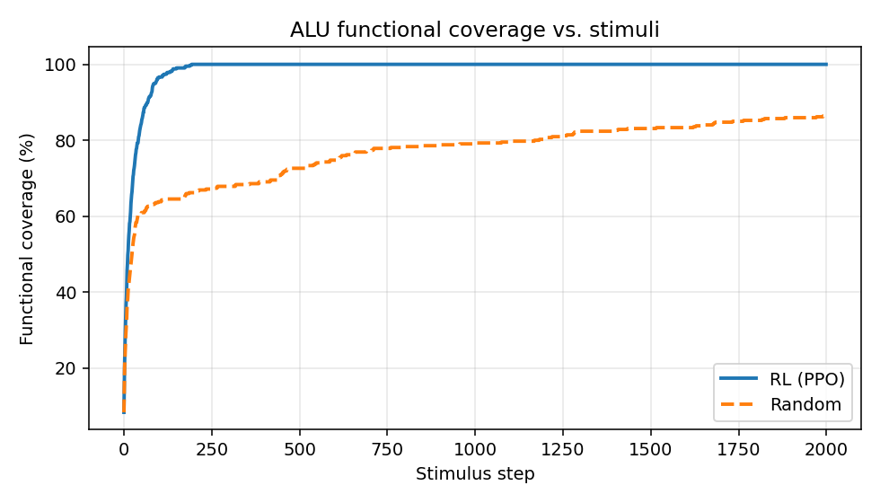

# ALU-UVM 8-bit with Python Reinforcement-Learning Stimulus Optimisation


Hardware-RTL verification flow for an 8-bit ALU that combines a fully
structured SystemVerilog UVM testbench with a Python Reinforcement Learning
stimulus generator. The RL agent drives the UVM sequencer through a
**2-way PyHDL-IF bridge** (no DPI-C intermediaries) and learns to minimise
the number of stimuli required to reach full functional-coverage closure.

On the default coverage model an offline-trained **PPO** policy reaches
100 % coverage in ~164 stimuli, while a random stimulus baseline plateaus at
~87 % even after 2 000 stimuli &mdash; a **12x coverage-closure speed-up**.

<p align="center">
  
</p>

---

## 1. Repository layout

```
.
├── DUT/                              # original unchanged 8-bit ALU RTL
│   ├── ALU_DUT.sv
│   └── ALU_interface.sv
├── Testbench/                        # original UVM testbench (kept intact)
├── tb_rl/                            # new, structured UVM testbench
│   ├── top/testbench_top.sv          # RL-enabled tb top
│   ├── tests/                        # uvm_test classes
│   ├── env/alu_env.sv                # uvm_env
│   ├── agents/alu_agent/             # agent + sub-component dirs
│   │   ├── sequence_items/           #   alu_seq_item.sv
│   │   ├── sequencer/                #   alu_sequencer.sv
│   │   ├── driver/                   #   alu_driver.sv
│   │   └── monitor/                  #   alu_monitor.sv
│   ├── sequences/                    # base/reset/random/directed sequences
│   ├── scoreboards/alu_scoreboard.sv
│   ├── coverage/alu_coverage_collector.sv
│   ├── bridge/                       # 2-way PyHDL-IF bridge
│   │   ├── alu_bridge_if.sv          #   SV interfaces wrapping TLM fifos
│   │   ├── alu_rl_bridge.sv          #   UVM bridge component
│   │   └── alu_rl_sequence.sv        #   UVM sequence pulling from Python
│   ├── pkg/alu_tb_pkg.sv             # package compiling all classes
│   └── filelist.f                    # single VCS -f file list
├── rl/                               # Python RL modules
│   ├── alu_model.py                  # Python reference ALU
│   ├── coverage_model.py             # SV-mirroring functional coverage
│   ├── alu_env.py                    # Gymnasium offline env
│   ├── bridge_env.py                 # Gymnasium env over the live UVM sim
│   ├── uvm_bridge.py                 # PyHDL-IF @hdl_if.api class
│   ├── train.py                      # SB3 PPO / DQN / A2C trainer
│   ├── evaluate.py                   # trained-policy evaluator
│   ├── random_baseline.py            # random baseline
│   └── compare.py                    # RL-vs-random report + plots
├── scripts/                          # helper run scripts
├── docs/                             # architecture, protocol, diagrams
│   ├── ARCHITECTURE.md
│   ├── BRIDGE_PROTOCOL.md
│   ├── RL_DESIGN.md
│   ├── img/*.mmd                     # Mermaid diagram sources
│   └── results/                      # generated comparison plots + tables
├── sim/vcs/                          # generated VCS build artefacts
├── Makefile                          # top-level build / run / train / compare
└── requirements.txt
```

## 2. Prerequisites

| Tool | Version | Notes |
|------|---------|-------|
| Synopsys VCS          | 2021.09+ with UVM-1.2 | simulator used by the Makefile |
| Python                | 3.10+                 | RL modules and PyHDL-IF |
| PyHDL-IF              | latest (`pip install pyhdl-if`) | HDL&lt;-&gt;Python bridge |
| Gymnasium             | 0.29+ (`pip install gymnasium`) | RL env API |
| stable-baselines3     | 2.2+ (`pip install stable-baselines3[extra]`) | PPO / DQN / A2C |

Install the Python side at once:

```bash
make deps      # -> pip install -r requirements.txt
```

No DPI-C shims are used anywhere in the flow. All communication between UVM
and Python goes through PyHDL-IF's TLM FIFOs (`tlm_hvl2hdl_fifo` &
`tlm_hdl2hvl_fifo`).

## 3. Quick start

### 3.1 Offline Python smoke test (no simulator needed)

```bash
make py-smoke                    # trains PPO for 5 000 steps, evaluates,
                                 # runs random baseline and renders
                                 # docs/results/compare.* comparison.
```

Expected output (machine-dependent):

```
RL    (PPO):  final coverage 100.0 %  mean steps-to-100% =  164
Random     :  final coverage  86.7 %  mean steps-to-100% = 2000
speedup: ~12x
```

### 3.2 Running UVM tests with VCS

| Target                  | What it does                                                          |
|-------------------------|-----------------------------------------------------------------------|
| `make sim TEST=alu_random_test`   | pure random UVM stimulus (baseline)                        |
| `make directed-sim`               | hand-written corner-case directed sequence                 |
| `make rl-sim MODEL=models/ppo/ppo_final.zip` | Python PPO policy drives the UVM sequencer via the bridge |
| `make legacy`                     | runs the original unchanged `Testbench/` flow              |
| `make sim COV=1 DUMP=1`           | enable functional-coverage + VCD dumps                     |

All Makefile knobs:

```
TEST          = alu_random_test | alu_directed_test | alu_rl_test
USE_RL        = 0 | 1         (set automatically by rl-sim)
ALGO          = PPO | DQN | A2C
NUM_ITEMS     = number of stimuli per simulation
SEED          = simulator seed
UVM_VERBOSITY = UVM_LOW|UVM_MEDIUM|UVM_HIGH|UVM_DEBUG
COV           = 0 | 1         (functional coverage on/off)
DUMP          = 0 | 1         (VCD wave dump)
GUI           = 0 | 1         (Verdi / dve)
TIMEOUT_NS    = simulation watchdog (ns)
MODEL         = path to SB3 .zip policy file (for rl-sim)
STEPS         = training steps (py-train)
MAX_STEPS     = steps per episode (py-train / py-eval)
EPISODES      = evaluation episodes
```

Run `make help` or `make show-config` for the complete list.

### 3.3 Training a policy

```bash
make py-train ALGO=PPO STEPS=50000       # models/ppo/ppo_final.zip
make py-train ALGO=DQN STEPS=50000       # uses a flattened discrete wrapper
make py-train ALGO=A2C STEPS=30000
make py-eval  ALGO=PPO EPISODES=10
```

### 3.4 Comparison report

```bash
make py-random EPISODES=10       # random baseline
make py-eval   ALGO=PPO EPISODES=10
make py-compare                  # renders docs/results/compare.{png,md,csv,json}
```

## 4. Architecture overview

```
                 +---------------------------------+
                 |             VCS / UVM           |
 +-----------+   |  +---------+   +-------------+  |
 | DUT (8-bit |   |  | Agent   |-->| Scoreboard  |  |
 |   ALU)     |<->|  | drv/mon |   | + Coverage  |  |
 +-----------+   |  +----+----+   +------+------+  |
                 |       ^               |         |
                 |       |               v         |
                 |   sequencer      +----+------+  |
                 |       ^          |  Bridge   |  |
                 |       |          +----+------+  |
                 |  +----+----+          |         |
                 |  |  RL Seq |          |         |
                 |  +----+----+          |         |
                 +-------|---------------|---------+
                         |               |
                req FIFO |               | rsp FIFO  (PyHDL-IF TLM)
                         v               ^
                 +-------+---------------+---------+
                 |        Python RL process        |
                 |  +---------+   +-------------+  |
                 |  | Gym Env |<->|  SB3 Policy |  |
                 |  | bridge_env  |  PPO/DQN/A2C|  |
                 |  +---------+   +-------------+  |
                 +---------------------------------+
```

See `docs/ARCHITECTURE.md` for the full diagram and a detailed walk-through,
`docs/BRIDGE_PROTOCOL.md` for the request/response packing and handshake
rules, and `docs/RL_DESIGN.md` for the MDP formulation, observation/action
spaces, reward shaping and algorithm choices.

## 5. Results

Generated from `make py-smoke` on the default SW coverage model:

| metric                    | PPO      | A2C      | Random |
|---------------------------|----------|----------|--------|
| mean final coverage       | **100 %** | **100 %** | 86.7 % |
| mean stimuli to 100 %     | **~164** | **~213** | n/a    |
| coverage-closure speed-up | **12x**  | **9.4x** | 1x     |

(Numbers refresh every time you run `make py-smoke`; exact values vary a
few percent with the seed.)


## 6. Design choices

* **Minimum-change constraint** &mdash; the original `DUT/` and `Testbench/`
  directories are retained verbatim; the new structured testbench lives in
  `tb_rl/` and can be run independently via `make sim`.
* **No DPI-C** &mdash; the bridge is built exclusively on PyHDL-IF's TLM
  FIFOs plus a thin SV interface wrapper (`tb_rl/bridge/alu_bridge_if.sv`).
* **Offline-first training, online evaluation** &mdash; RL is trained
  against a Python reference model whose coverage bins mirror the SV
  covergroup, then frozen and replayed against the live RTL simulation.
  This keeps episodic training fast and cheap.
* **2-way bridge** &mdash; beyond the request channel, the bridge also
  carries UVM responses (coverage %, scoreboard mismatch, DUT outputs)
  back to the agent so the MDP reward can reflect real RTL coverage.
* **Timeouts & handshakes** &mdash; both sides poll with a bounded
  cycle/time budget and fall back to safe behaviour (random item inject
  on the SV side; step-truncation on the Python side).

## 7. License & credits

The base ALU DUT and UVM testbench shell came from the original
`ALU_Testbench_UVM_8Bit` repository &mdash; left unchanged. All new code
under `tb_rl/`, `rl/`, `scripts/`, `docs/` and the top-level Makefile is
provided under the MIT license (see `LICENSE`).
