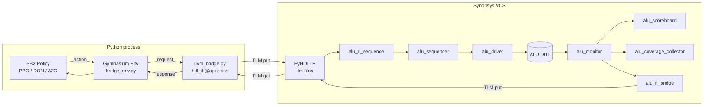
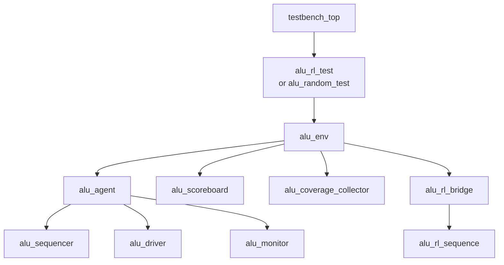

# Architecture

## 1. End-to-end data flow

## 2. UVM testbench tree

## 3. Files & responsibilities

| File | Role |
|------|------|
| `tb_rl/top/testbench_top.sv` | clock/reset, DUT instantiation, `run_test` |
| `tb_rl/agents/alu_agent/**`  | sequencer / driver / monitor / agent |
| `tb_rl/sequences/**`         | base / reset / random / directed sequences |
| `tb_rl/scoreboards/alu_scoreboard.sv` | golden-model scoreboard |
| `tb_rl/coverage/alu_coverage_collector.sv` | functional coverage |
| `tb_rl/bridge/alu_bridge_if.sv` | SV wrappers around the TLM FIFOs |
| `tb_rl/bridge/alu_rl_bridge.sv` | UVM bridge component (2-way) |
| `tb_rl/bridge/alu_rl_sequence.sv` | UVM sequence pulling from Python |
| `tb_rl/env/alu_env.sv`          | uvm_env that wires everything together |
| `tb_rl/tests/**`                | UVM tests: random / directed / RL |
| `tb_rl/pkg/alu_tb_pkg.sv`       | single `package` compiling all classes |
| `rl/coverage_model.py`          | Python-side mirror of the cover-group |
| `rl/alu_env.py`                 | offline Gymnasium env |
| `rl/bridge_env.py`              | online Gymnasium env (calls PyHDL-IF) |
| `rl/uvm_bridge.py`              | `@hdl_if.api` class loaded by VCS |
| `rl/train.py`                   | stable-baselines3 training driver |
| `rl/evaluate.py`                | evaluation driver |
| `rl/random_baseline.py`         | random baseline for comparison |
| `rl/compare.py`                 | report + plot generator |

## 4. Clocking & timing

* Clock is generated in `testbench_top` at 100 MHz.
* The DUT registers all outputs synchronously; the monitor samples
  `A/B/op_code/C_in/Reset` one cycle before `Result/C_out/Z_flag`.
* The bridge's `alu_req_if` and `alu_rsp_if` share the same clock so
  credits/handshakes stay in lock-step with the agent clock.

## 5. Configurability via `uvm_config_db`

| Key               | Type        | Default | Source          |
|-------------------|-------------|---------|-----------------|
| `intf`            | `virtual ALU_interface` | set by `testbench_top` | required |
| `req_vif`         | `virtual alu_req_if`    | set by `testbench_top` | required |
| `rsp_vif`         | `virtual alu_rsp_if`    | set by `testbench_top` | required |
| `use_rl`          | `bit`       | 0       | `+USE_RL` plusarg  |
| `num_items`       | `int`       | 1000    | `+NUM_ITEMS`       |
| `req_timeout_cycles` | `int`    | 2000    | optional           |
| `rsp_timeout_cycles` | `int`    | 2000    | optional           |
| `max_items`       | `int`       | 0       | set by alu_rl_test |

Everything else &mdash; UVM verbosity, seed, test name &mdash; is controlled
through the standard UVM plusargs (see `README.md`).
